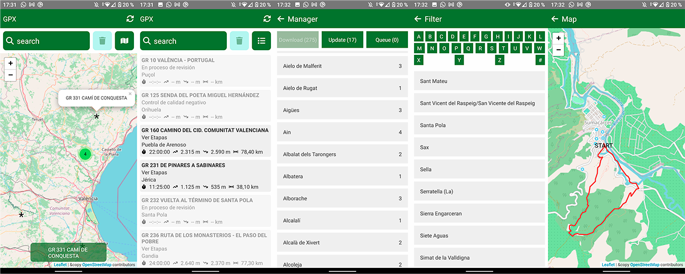
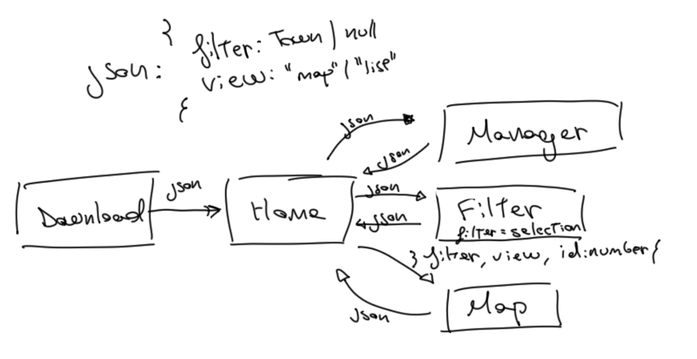
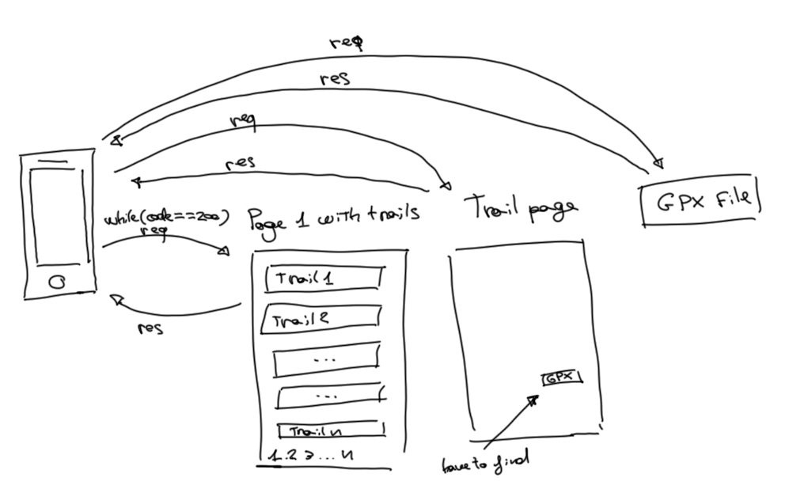
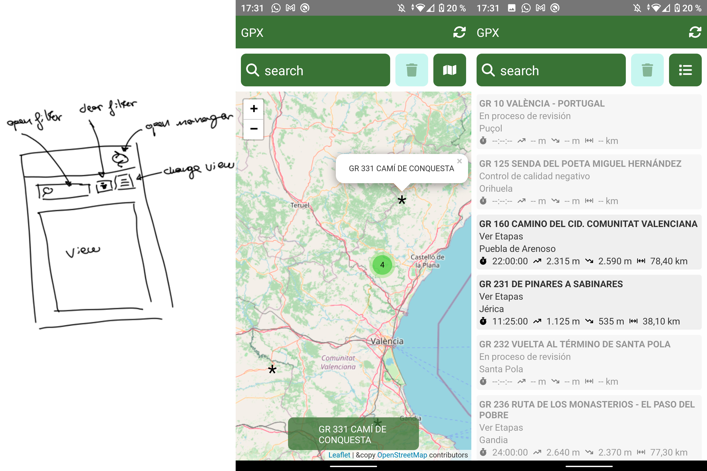
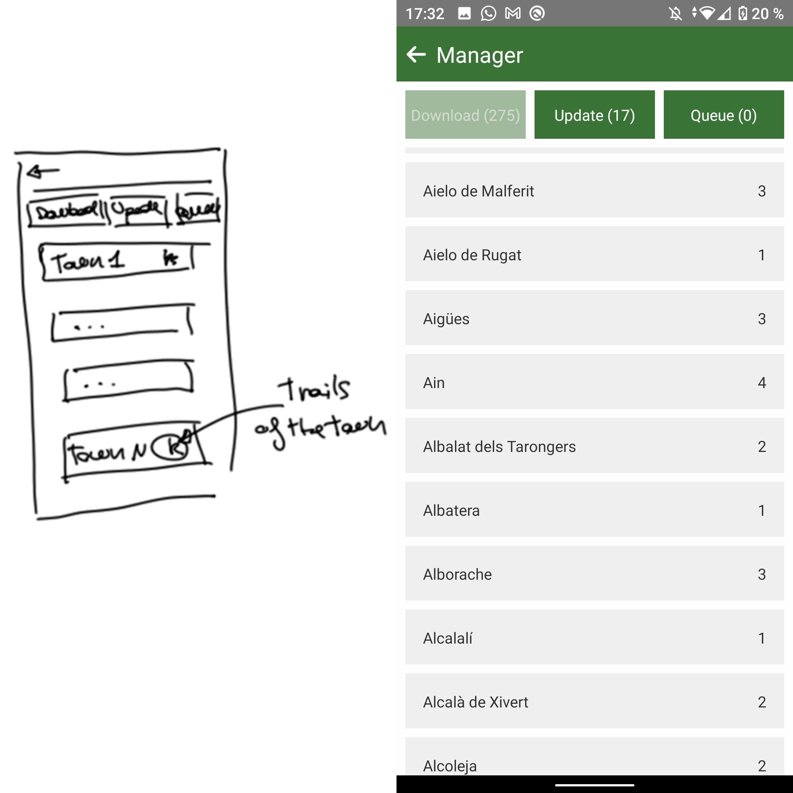
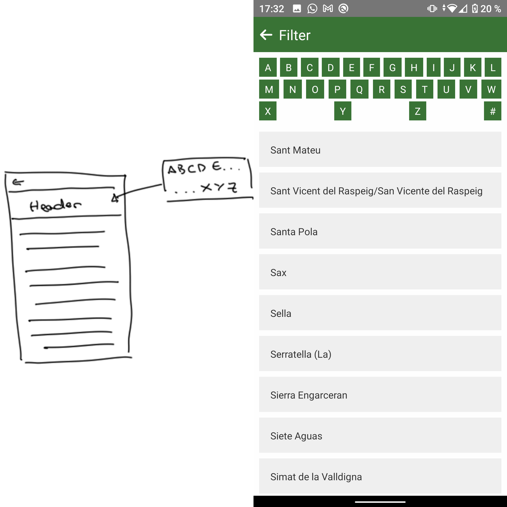
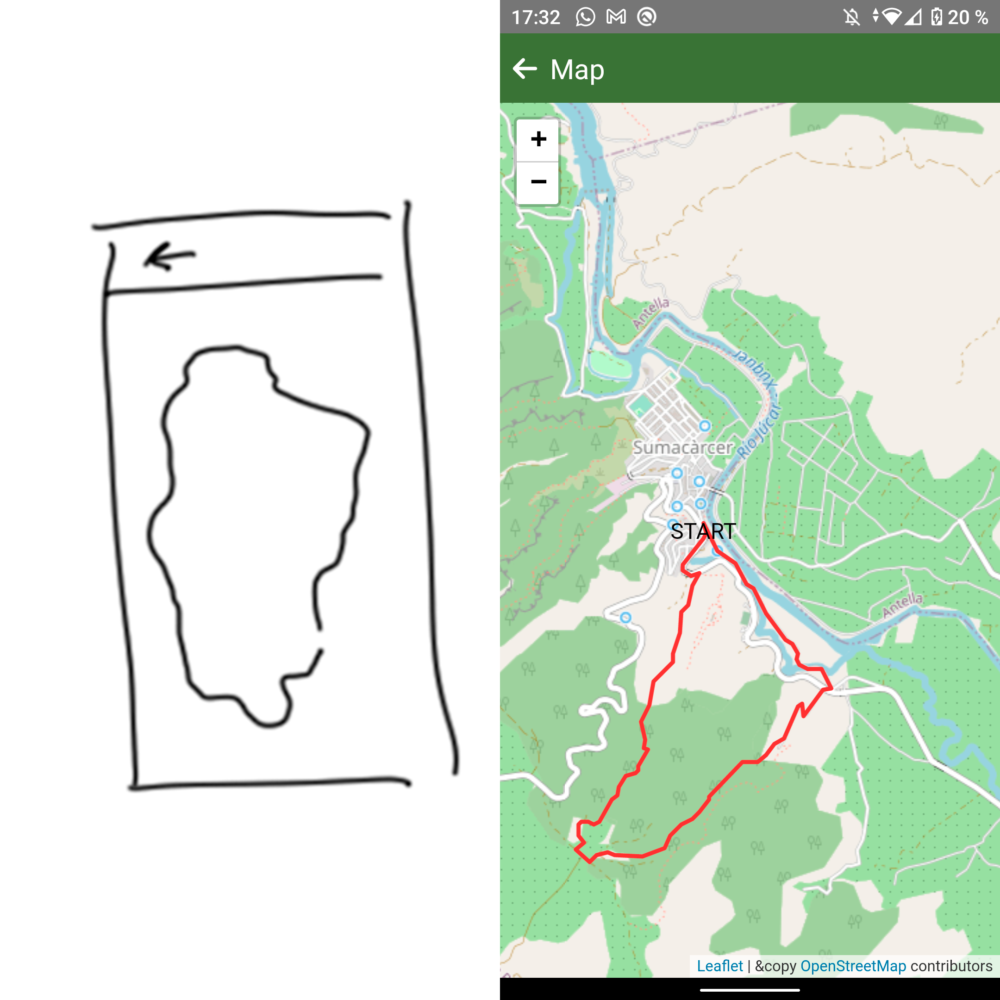

# GPX-FEMECV
React Native project. Use SQLite to local storage, Leaflet as map library, FlashList to render more than 600 items and HTMLParse to parse html info. Read every hiking trail page from FEMECV and parse HTML public pages into data to work with, also parse GPX files (XML data) into data to work with too. Finally, show the route of the trail. The most of the code is tested and its efficiency has been analyzed to run the application as fast as it can.



### Run
1. Connect smartphone to PC
2. Active USB debuggin
3. Active data transfer
4. Run project ```npx react-native start```
5. Run project on android ```npx react-native run-android```

## Screens and navigation


The app has 4 screens (5 reals). Later I will explain each one, but first I explain how load data and how run the navigation.
As you can see, allways pass the same json through screen (but one not). The json:
```
{
    filter: Town | null,
    view: "map" | "list",
//  id: int
}
```
indicates the home page state. To keep the state values, every page return the json. Filter page is the only one who can change the ```filter``` value and Home page is the only one who can change the ```view``` value.

You could think is better load every data at once and pass it through screens, but while I was developing I realize that react native can not do it well, just pass an array with 600 strings make the render of screen so slow. It is faster to load from database than pass values. That is why every page has a [Load](./src/components/Load.js) component to load from database the necessary data and the page just works with the specific data.

Finally, it is for that reason that json has an extra attribute, the ```id```. The ```id``` just pass when you want to open a trail and load the route.

### How works
As quick summary: first open the [Download](./src/PageDownload.js) page and test if the app needs to download data, if not navigate to [Home](./src/PageHome.js) page. Home load every trail and create an array to display the points of each trail (if there are). Across Home you can go: to the [Manager](./src/PageManager.js) which downloads the information of each trail, to the [Filter](./src/PageFilter.js) which allows you pick a town to filter by and the [Map](./src/PageMap.js) page to shows the trail route.

## Database
[https://github.com/andpor/react-native-sqlite-storage](https://github.com/andpor/react-native-sqlite-storage)


The [Database](./src/utilities/Database.js) works like static class. In this way, it can keep the opened conexion from database. The class has two method: open the database conexion and execute a SQL command. If the SQL is ```SELECT``` the result will be formatted into array and return it, if not just return ```true``` o ```false```.

The app saves all information about the trail. Also the database has three extra columns, one to indicate if there are or not points, and two more to give easy access to the first point (to show in Home page). In the other table, saves all points from each trail.

## Web
[https://github.com/g6ling/react-native-html-parser](https://github.com/g6ling/react-native-html-parser)



The [Web](./src/utilities/Web.js) class is static too. It requests data from the [FEMECV](https://senders.femecv.com/) and extract the info through HTML result. The FEMECV has not api, so the data is extracted from the public HTML pages. To do it, use a HTML parse, but the library is so confused and it is hard to understand the return values from the each function, so this is the one code how is not efficient at all.

## Map
[https://github.com/pavel-corsaghin/react-native-leaflet](https://github.com/pavel-corsaghin/react-native-leaflet)

The Map library is not good documented. Also it has problems to display the map in low android versions. So I explain what I can. You have to remember that is what I have used, not all that the library can made.

To show points use the input ```mapMarkers```. This is an array of markers. The marker attributes that I use are:
```
MapMarker {
    position: LatLng;
    icon: any;
    id?: string;
    size?: Point;
    title?: string;
}
LatLng {
    lat: number;
    lng: number
}
Point [ number, number ]
```
And then pass the array to map component. The ```icon``` is what you view on the map, and when click the marker displays a popup with the ```title```, also trigger an event ```onMapMarkerClicked``` where you can find the ```id``` marker.

To draw shapes, I mean, the trail route, use this:
```
MapShape {
    center?: LatLng;
    color?: string;
    positions?: LatLng[] | LatLng[][];
    shapeType: MapShapeType;
}
LatLng {
    lat: number;
    lng: number
}
MapShapeType {
    CIRCLE = "Circle",
    CIRCLE_MARKER = "CircleMarker",
    POLYLINE = "Polyline",
    POLYGON = "Polygon",
    RECTANGLE = "Rectangle"
}
```
Also, a good practice, is set a mark in the first point, in case that is a circular route.

I allways calculate the center, to center the map. If I do not, the map display has default center the Pacific Ocean.

## Download page

The [Download](./src/PageDownload.js) page just reads if there is data. As I have said before, just reads if there are trails, and if not it will be downloaded. If the trails exist, just jump to Home.

## Home page



The [Home](./src/PageHome.js) page shows the trails and allows navigate to other pages. First, it loads every trail from database, and then prepare an array with all marks for the map. Also, calculates the center position using every points.

It has one button on the toolbar to navigate to Manager page. Three buttons on the header, one to opens the filter, other to clears the filter and last one to changes the view between map and list. To show the map and the list use the [HomeMap](./src/components/HomeMap.js) and [HomeList](./src/components/HomeList.js) components.

To open a trail with the map, I set to each mark an id concat with its name. When press on one mark, it triggers an event and get the id from the mark which is pressed. From that id, extracts the real id and the name.

## Manager page



The [Manager](./src/PageManager.js) page is the most efficient. Here downloads the points of each trail, so it has to be the faster of pages. I has three views:
+ Download: the trails which not try to download its data before.
+ Update: the trails which have data.
+ Queue: the trails waiting to download the data.

In this page there are two problems: one, clasificate each trail if is download or update, and parse the information into array.

First I analyze the diferencie between use an array, an object, and a map to clasifcate the trails and parse into values array. This is an example that I have made to clasificate the trails by town:

Array
```js
let arrayTrail = [], arrayTime = 0;
while () {
    let start = new Date().getTime(), finish = 0;
    if (arrayTrail.find(t => t.town == trail.town) == undefined) {
        arrayTrail.push(trail);
    }
    finish = new Date().getTime();
    arrayTime += finish - start;
}

//console.log(arrayTime) => 148
```

Object
```js
let objectTrail = {}, objectTime = 0;
while () {
    let start = new Date().getTime(), finish = 0;
    if (objetTrail[trail.town] == undefined) {
        objetTrail[trail.town] = trail;
    }
    finish = new Date().getTime();
    objectTime += finish - start;
}

let start = new Date().getTime();
objetTrail = Object.values(objetTrail);
let finish = new Date().getTime();
objectTime += finish - start;

//console.log(objectTime) => 14
```

Map
```js
let mapTrail = new Map(), mapTime = 0;
while () {
    let start = new Date().getTime(), finish = 0;
    if (!mapTrail.has(trail.town)) {
        mapTrail.set(trail.town, trail);
    }
    finish = new Date().getTime();
    mapTime += finish - start;
}

let start = new Date().getTime();
mapTrail = Array.from(mapTrail.values());
let finish = new Date().getTime();
mapTime += finish - start;

//console.log(mapTime) => 7
```
In my surprise, object is not too far from map. The map is in the most cases better, but it is true, there are some times that object take better times.

Now I know that map works better, I have to analyze who is better: parse the map into array with its own methods, or get the array and format it: 

Map
```js
let start = new Date().getTime(), finish = 0;
new Map([...map].sort());
finish = new Date().getTime();
console.log('map', finish - start);

//LOG> map 15
```
Array
```js
let start = new Date().getTime(), finish = 0;
let array = Array.from(map.keys());
array.sort();
for (let i = 0; i < array.length; i++) {
    array[i] = {
        key: array[i],
        size: mapDownloadTrails.get(array[i]).length
    };
}
finish = new Date().getTime();
console.log('array', finish - start);

//LOG> 1
```

In this case, the array works much better that the own map methods.

Now I have the faster methods to works with. This is special important because the action when press a trail must be immediate.

## Filter page



The [Filter](./src/PageFilter.js) page just returns the town selected. It has a header with the alphabet to filter quickly the towns, and then choose it more easy. When pick a town, modify the ```filter``` attribute from params.

## Map page



The [Map](./src/PageMap.js) page shows the shape of the trail. This page, before shows the map if its can (if it has points), look for its points. If it has not defined the ```points``` attribute, try to download and save it. After download and save the points (if has) shows the map.