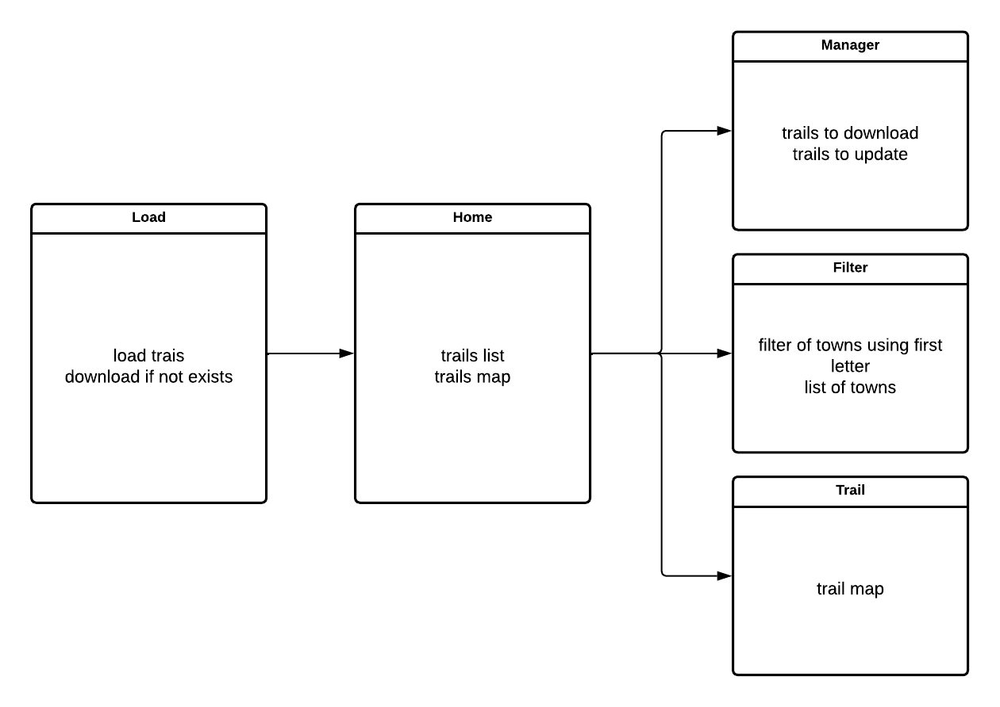

# GPX-FEMECV
React Native project. Use local storage with SQLite, Leaflet as map library, render more than 600 items and read and parse html info. Read every hiking trails page in HTML from hiking club. Read every page format HTML and parse the usefull information to JSON. Also for each hiking trail get GPX file and parse to JSON too. Finally you can view the information in list or map format.

## Develop
1. Connect smartphone to PC
2. Active USB debuggin
3. Active data transfer
4. Run project ```npx react-native start```
5. Run project on android ```npx react-native run-android```

## Software

### Screens and navigation


1. To initialize the app, first load every trail and formated to array that app will work properly. If not exists the trails, must download from the website.

2. Home page contains a list of trails where you can click and open or a map with each trail where you can click either. Also has two functions, navigate to open the filters and pick quickly or navigate to download or update the trails of each town.
    + Manager page has two list, one with trails to download and one with trils already download but update.
    + Filter page has a picker with the alphabet which filter a list of towns.

### Load page
When run the app, first, if not exists create the database. Then try to get data from DB, if is empty start to download every trails information. After that, get data from DB and format into array object to work with adding visible attribute to make easy the filter process. As the id number is asigned sequentially we can use the array as map data, where the key is the id trail. If the trail has points, use the weak type and asign the array points in points attribute of trail object. When the process finish, pass the trails to Home page.

### Home page
If there is no data, show a warning, else show the map as default. The home page can show the trails in a map or list.

### Manager page

### Filter page

### Trail page