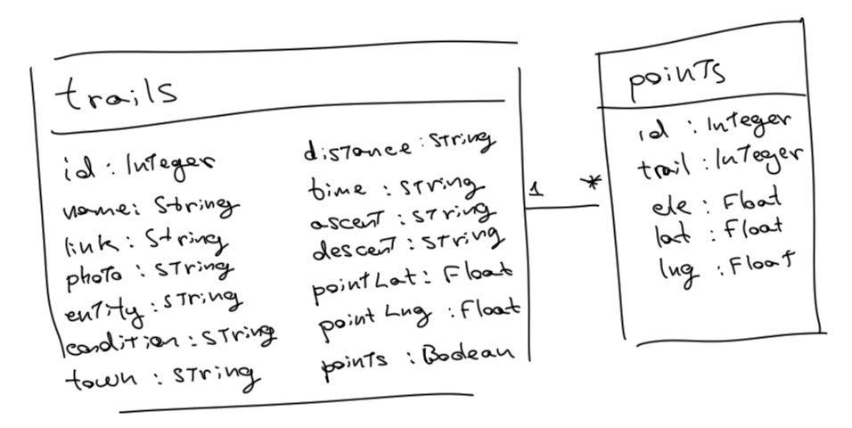

# GPX-FEMECV
React Native project. Use local storage with SQLite, Leaflet as map library, FlashList render more than 600 items and read and HTMLParse to parse html info. Read every hiking trail page from FEMECV and parse HTML public pages into data to work with, also parse GPX files (XML data) int data to work with too. Finally, show the route of the trail. The most of the code is tested and its efficiency has been analyzed to run the application as fast as it can.


### Run
1. Connect smartphone to PC
2. Active USB debuggin
3. Active data transfer
4. Run project ```npx react-native start```
5. Run project on android ```npx react-native run-android```

## Screens and navigation


The app has 4 screens, (5 reals). Later I explain each one, but first I comment how load the data and how is the navigation.
As you can see, allways pass the same json through screen, but one not. The json:
```
{
    filter: Town | null,
    view: "map" | "list",
//  id: int
}
```
indicates the state of the home page. To keep the state of the Home, everypage page must return the json. Filter page is the only one who can change the filter value. Home page is the only one who can change the view value.

You can think that is better load every data at once and pass through screens, but while I was developing I realize that react native can't do it, pass an array with 600 strings make the render of screen so slow. You think that it is more faster load from database that passing values. It's for that that each page has a [Load](./src/components/Load.js) component to load from database the necessary data and works just with the specific data.

Finally, it's for that reason that the json has an extra attribute, the ```id```. The id just pass when you want to open a trail and load all its points.

### How works
As quick work summary: first open the [Download](./src/PageDownload.js) page and test if it needs to download the data, if not navigate to [Home](./src/PageHome.js) page. Home load every trail and create an array to display the points of the starts for each trail (if there are). Across Home you can go: to the [Manager](./src/PageManager.js) which download the information of each trail, to the [Filter](./src/PageFilter.js) which allows you pick a town to filter by and the [Map](./src/PageMap.js) page to view the trail route.

## Database
[https://github.com/andpor/react-native-sqlite-storage](https://github.com/andpor/react-native-sqlite-storage)



The [Database](./src/utilities/Database.js) works like a static class. In this way, whe can keep the opened conexion to the databa and access with some facility. The class has two method: open the database conexion, and execute and SQL command. If the sql is a ```SELECT``` the result is formated into array and return, if not just return ```true``` o ```false```.

The app save all information about the trail. Also add three more columns, one to indicate if has or no points, and two more to it has easy access to the first point (to show in Home page). In other table, save all points for each trail.

## Web
[https://github.com/g6ling/react-native-html-parser](https://github.com/g6ling/react-native-html-parser)


The [Web](./src/utilities/Web.js) class is static too. It request the data from the [FEMECV](https://senders.femecv.com/) and extract the info through HTML result. The FEMECV has not api, so the data is extracted from the public HTML pages. To do that, use a HTML parse, but the library is so confused and it is hard to understand the return values from the each function, so this is the one code how is not efficient at all.

## Map
[https://github.com/pavel-corsaghin/react-native-leaflet](https://github.com/pavel-corsaghin/react-native-leaflet)

The Map library is not good documented. Also has problems to display the map in low android versions. So I gonna explain what I can. You have to remember that is what I have used, not all that the library has.

To show points use the input ```mapMarkers```. This is an array of markers. The marker attributes that I use are:
```
MapMarker {
    position: LatLng;
    icon: any;
    id?: string;
    size?: Point;
    title?: string;
}
LatLng {
    lat: number;
    lng: number
}
Point [ number, number ]
```
And then pass the array to the map component. The ```icon``` is what you view on the map, and when click the marker displays a popup with the ```title```, also trigger an event ```onMapMarkerClicked``` where you can find the ```id``` marker.

To draw shapes, I mean, the trail route use this:
```
MapShape {
    center?: LatLng;
    color?: string;
    positions?: LatLng[] | LatLng[][];
    shapeType: MapShapeType;
}
LatLng {
    lat: number;
    lng: number
}
MapShapeType {
    CIRCLE = "Circle",
    CIRCLE_MARKER = "CircleMarker",
    POLYLINE = "Polyline",
    POLYGON = "Polygon",
    RECTANGLE = "Rectangle"
}
```
Also, a good practice is set a mark in the first points, in case that the route is circular.

I allways calculate the center of the positions to center the map. If not do it, the map display has default the Pacific Ocean.

## Download page

The [Download](./src/PageDownload.js) page just test if exist data. As I have said before, just test if exists the trails, and if not download. If the trails exist, just jump into Home.

## Home page


The [Home](./src/PageHome.js) page show the trails and allows to navigate to other pages. First load every trail from database, and then prepare an array with all marks for the map. Also, calculate the center position from all points.

It has one button on the toolbar to navigate to Manager page. Three buttons on the header, one for open the filter, other to clear the filter and last one to change the view between map and list. To show the map and the list use the [HomeMap](./src/components/HomeMap.js) and [HomeList](./src/components/HomeList.js) components.

To open a trail with the map, I set for each mark and id concat with its name. When press on one mark, it trigger an event and can get the id from the mark which is pressed. From that id split the string and get the name.

## Manager page


The [Manager](./src/PageManager.js) page is the most efficient. Here download the points of each trail, so it has to be the faster of pages. I has three views:
+ Download: the trails which not try to download its data before.
+ Update: the trails which have data.
+ Queue: the trails waiting to download the data.

In this page we have two problems: one, clasificate each trail if is download or update, and parse the information into array.

First I analyze the diferencie between use an array, an object, and a map to clasifcate the trails and parse into values array. This is an example that I have made to clasificate the trails by town:

Array
```js
let arrayTrail = [], arrayTime = 0;
while () {
    let start = new Date().getTime(), finish = 0;
    if (arrayTrail.find(t => t.town == trail.town) == undefined) {
        arrayTrail.push(trail);
    }
    finish = new Date().getTime();
    arrayTime += finish - start;
}

//console.log(arrayTime) => 148
```

Object
```js
let objectTrail = {}, objectTime = 0;
while () {
    let start = new Date().getTime(), finish = 0;
    if (objetTrail[trail.town] == undefined) {
        objetTrail[trail.town] = trail;
    }
    finish = new Date().getTime();
    objectTime += finish - start;
}

let start = new Date().getTime();
objetTrail = Object.values(objetTrail);
let finish = new Date().getTime();
objectTime += finish - start;

//console.log(objectTime) => 14
```

Map
```js
let mapTrail = new Map(), mapTime = 0;
while () {
    let start = new Date().getTime(), finish = 0;
    if (!mapTrail.has(trail.town)) {
        mapTrail.set(trail.town, trail);
    }
    finish = new Date().getTime();
    mapTime += finish - start;
}

let start = new Date().getTime();
mapTrail = Array.from(mapTrail.values());
let finish = new Date().getTime();
mapTime += finish - start;

//console.log(mapTime) => 7
```
In my surprise, object is not too far from map. The map in the most of the cases give better times, but there are times that object di it better.

Now that we know the map works better to clasificate the trails, we have to analyze who is better: parse the map into array with its own methods, or get the array and format: 

Map
```js
let start = new Date().getTime(), finish = 0;
new Map([...map].sort());
finish = new Date().getTime();
console.log('map', finish - start);

//LOG> map 15
```
Array
```js
let start = new Date().getTime(), finish = 0;
let array = Array.from(map.keys());
array.sort();
for (let i = 0; i < array.length; i++) {
    array[i] = {
        key: array[i],
        size: mapDownloadTrails.get(array[i]).length
    };
}
finish = new Date().getTime();
console.log('array', finish - start);

//LOG> 1
```

In this case, the array works much better that the own map methods.

Now we have the faster methods to works with the data. This is special important because the action when press a trail must be immediate.

## Filter page


The [Filter](./src/PageFilter.js) page just return the town selected. It has a header with the alphabet to filter quickly the towns, and then choose it more easy. When pick a town, modify the filter attribute from params.

## Map page


The [Map](./src/PageMap.js) page show the shape of the trail. This page, before show the map if its can (if has points), look for its points. If it has not defined the ```points``` attribute, try to download and save it. After download and save the points (if have) show the map.